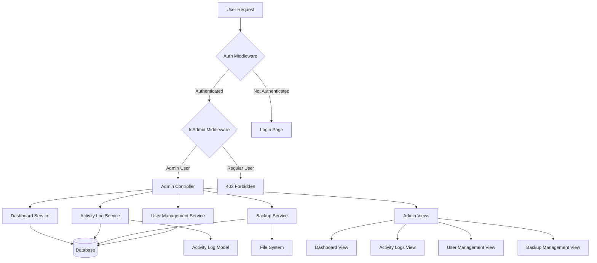
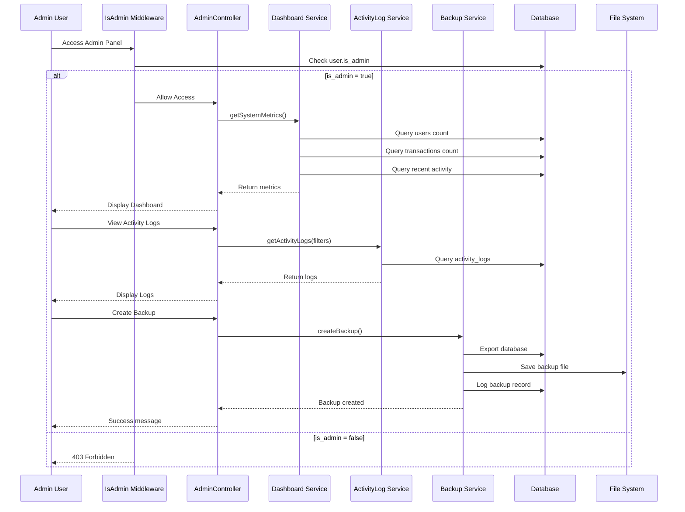

# Design Document: Admin Panel

## Overview

The Admin Panel feature provides system administrators with comprehensive control and visibility over the Laravel personal financial tracker application. This feature introduces role-based access control (RBAC) to distinguish between regular users and administrators, enabling administrators to monitor system-wide metrics, track user activities, manage database backups, and perform administrative operations. The admin panel will be accessible only to users with admin privileges and will provide real-time insights into system health, user engagement, and data management capabilities.

The design follows Laravel best practices, utilizing middleware for authentication and authorization, Eloquent ORM for database operations, and Blade templates for the user interface. The system will maintain backward compatibility with existing user functionality while adding a new administrative layer.

## Architecture




## Main Algorithm/Workflow




## Components and Interfaces

### Component 1: IsAdmin Middleware

**Purpose**: Verify that the authenticated user has administrator privileges before allowing access to admin routes.

**Interface**:
```php
namespace App\Http\Middleware;

use Closure;
use Illuminate\Http\Request;
use Symfony\Component\HttpFoundation\Response;

class IsAdmin
{
    public function handle(Request $request, Closure $next): Response;
}
```

**Responsibilities**:
- Check if the authenticated user has `is_admin` flag set to true
- Redirect or abort with 403 if user is not an admin
- Allow request to proceed if user is admin

### Component 2: AdminController

**Purpose**: Handle all admin panel HTTP requests and coordinate between services and views.

**Interface**:
```php
namespace App\Http\Controllers;

use Illuminate\Http\Request;
use Illuminate\View\View;
use Illuminate\Http\RedirectResponse;
use Illuminate\Http\JsonResponse;

class AdminController extends Controller
{
    public function dashboard(): View;
    public function users(): View;
    public function userShow(int $userId): View;
    public function userToggleStatus(int $userId): RedirectResponse;
    public function activityLogs(Request $request): View;
    public function backups(): View;
    public function createBackup(): RedirectResponse;
    public function downloadBackup(int $backupId): Response;
    public function deleteBackup(int $backupId): RedirectResponse;
    public function systemSettings(): View;
    public function updateSystemSettings(Request $request): RedirectResponse;
}
```

**Responsibilities**:
- Handle admin dashboard requests
- Manage user administration operations
- Display and filter activity logs
- Coordinate backup operations
- Manage system-wide settings


### Component 3: DashboardService

**Purpose**: Aggregate and compute system-wide metrics for the admin dashboard.

**Interface**:
```php
namespace App\Services\Admin;

class DashboardService
{
    public function getSystemMetrics(): array;
    public function getTotalUsers(): int;
    public function getActiveUsers(int $days = 30): int;
    public function getTotalTransactions(): int;
    public function getTransactionVolume(): float;
    public function getRecentActivity(int $limit = 10): Collection;
    public function getUserGrowthData(int $months = 6): array;
    public function getTransactionTrends(int $months = 6): array;
}
```

**Responsibilities**:
- Calculate total user count
- Determine active users within a time period
- Aggregate transaction statistics
- Retrieve recent system activity
- Generate growth and trend data for charts

### Component 4: ActivityLogService

**Purpose**: Record and retrieve system activity logs for audit and monitoring purposes.

**Interface**:
```php
namespace App\Services\Admin;

use Illuminate\Pagination\LengthAwarePaginator;
use Illuminate\Support\Collection;

class ActivityLogService
{
    public function log(string $action, string $description, ?int $userId = null, ?array $metadata = null): void;
    public function getActivityLogs(array $filters = [], int $perPage = 50): LengthAwarePaginator;
    public function getUserActivity(int $userId, int $limit = 50): Collection;
    public function getActionTypes(): array;
    public function deleteOldLogs(int $daysToKeep = 90): int;
}
```

**Responsibilities**:
- Log user actions and system events
- Retrieve paginated activity logs with filtering
- Get activity history for specific users
- Provide available action types for filtering
- Clean up old log entries


### Component 5: BackupService

**Purpose**: Create, manage, and restore database backups.

**Interface**:
```php
namespace App\Services\Admin;

use Illuminate\Support\Collection;

class BackupService
{
    public function createBackup(string $description = ''): Backup;
    public function listBackups(): Collection;
    public function getBackup(int $backupId): ?Backup;
    public function downloadBackup(int $backupId): string;
    public function deleteBackup(int $backupId): bool;
    public function restoreBackup(int $backupId): bool;
    public function getBackupSize(int $backupId): int;
    public function cleanupOldBackups(int $keepCount = 10): int;
}
```

**Responsibilities**:
- Create SQLite database backups
- Store backup metadata in database
- Provide backup file downloads
- Delete backup files and records
- Restore database from backup
- Manage backup retention policies

### Component 6: UserManagementService

**Purpose**: Provide administrative operations for user management.

**Interface**:
```php
namespace App\Services\Admin;

use App\Models\User;
use Illuminate\Pagination\LengthAwarePaginator;

class UserManagementService
{
    public function getAllUsers(array $filters = [], int $perPage = 25): LengthAwarePaginator;
    public function getUserDetails(int $userId): array;
    public function toggleUserStatus(int $userId): User;
    public function deleteUser(int $userId): bool;
    public function getUserStatistics(int $userId): array;
    public function promoteToAdmin(int $userId): User;
    public function revokeAdmin(int $userId): User;
}
```

**Responsibilities**:
- List and filter users
- Retrieve detailed user information
- Enable/disable user accounts
- Delete user accounts and associated data
- Calculate user-specific statistics
- Manage admin role assignments


## Data Models

### Model 1: User (Extended)

```php
namespace App\Models;

use Illuminate\Foundation\Auth\User as Authenticatable;

class User extends Authenticatable
{
    protected $fillable = [
        'name',
        'email',
        'password',
        'currency',
        'is_admin',      // NEW: Admin flag
        'is_active',     // NEW: Account status
        'last_login_at', // NEW: Last login timestamp
    ];

    protected $casts = [
        'email_verified_at' => 'datetime',
        'password' => 'hashed',
        'is_admin' => 'boolean',
        'is_active' => 'boolean',
        'last_login_at' => 'datetime',
    ];

    public function isAdmin(): bool;
    public function isActive(): bool;
    public function activate(): void;
    public function deactivate(): void;
}
```

**Validation Rules**:
- `is_admin` must be boolean (default: false)
- `is_active` must be boolean (default: true)
- `last_login_at` must be valid datetime or null

### Model 2: ActivityLog

```php
namespace App\Models;

use Illuminate\Database\Eloquent\Model;
use Illuminate\Database\Eloquent\Relations\BelongsTo;

class ActivityLog extends Model
{
    protected $fillable = [
        'user_id',
        'action',
        'description',
        'ip_address',
        'user_agent',
        'metadata',
    ];

    protected $casts = [
        'metadata' => 'array',
        'created_at' => 'datetime',
    ];

    public function user(): BelongsTo;
    public function getActionLabel(): string;
    public function getMetadataValue(string $key, mixed $default = null): mixed;
}
```

**Validation Rules**:
- `action` is required, max 50 characters
- `description` is required, max 500 characters
- `ip_address` must be valid IP address format
- `metadata` must be valid JSON array


### Model 3: Backup

```php
namespace App\Models;

use Illuminate\Database\Eloquent\Model;
use Illuminate\Database\Eloquent\Relations\BelongsTo;

class Backup extends Model
{
    protected $fillable = [
        'filename',
        'path',
        'size',
        'description',
        'created_by',
        'status',
    ];

    protected $casts = [
        'size' => 'integer',
        'created_at' => 'datetime',
    ];

    public function creator(): BelongsTo;
    public function getFormattedSize(): string;
    public function exists(): bool;
    public function delete(): bool;
}
```

**Validation Rules**:
- `filename` is required, unique, max 255 characters
- `path` is required, max 500 characters
- `size` must be positive integer (bytes)
- `status` must be one of: 'pending', 'completed', 'failed'
- `created_by` must reference valid user ID

### Model 4: SystemSetting

```php
namespace App\Models;

use Illuminate\Database\Eloquent\Model;

class SystemSetting extends Model
{
    protected $fillable = [
        'key',
        'value',
        'type',
        'description',
    ];

    protected $casts = [
        'value' => 'string',
    ];

    public static function get(string $key, mixed $default = null): mixed;
    public static function set(string $key, mixed $value): void;
    public function getCastValue(): mixed;
}
```

**Validation Rules**:
- `key` is required, unique, max 100 characters
- `type` must be one of: 'string', 'integer', 'boolean', 'json'
- `description` is optional, max 500 characters


## Algorithmic Pseudocode

### Main Dashboard Metrics Algorithm

```php
/**
 * Algorithm: Calculate System Metrics
 * 
 * Preconditions:
 * - Database connection is established
 * - User is authenticated as admin
 * 
 * Postconditions:
 * - Returns array with all system metrics
 * - All counts are non-negative integers
 * - All calculations are accurate as of execution time
 */
function getSystemMetrics(): array
{
    // Step 1: Calculate user statistics
    totalUsers = User::count()
    activeUsers = User::where('last_login_at', '>=', now()->subDays(30))->count()
    newUsersThisMonth = User::whereMonth('created_at', now()->month)->count()
    
    // Step 2: Calculate transaction statistics
    totalTransactions = Transaction::count()
    transactionVolume = Transaction::sum('amount')
    transactionsThisMonth = Transaction::whereMonth('created_at', now()->month)->count()
    
    // Step 3: Calculate financial statistics
    totalIncome = Transaction::where('type', 'income')->sum('amount')
    totalExpenses = Transaction::where('type', 'expense')->sum('amount')
    
    // Step 4: Get recent activity
    recentActivity = ActivityLog::with('user')
        ->orderBy('created_at', 'desc')
        ->limit(10)
        ->get()
    
    // Step 5: Calculate system health metrics
    databaseSize = getDatabaseSize()
    backupCount = Backup::where('status', 'completed')->count()
    lastBackup = Backup::where('status', 'completed')
        ->orderBy('created_at', 'desc')
        ->first()
    
    return [
        'users' => [
            'total' => totalUsers,
            'active' => activeUsers,
            'new_this_month' => newUsersThisMonth,
        ],
        'transactions' => [
            'total' => totalTransactions,
            'volume' => transactionVolume,
            'this_month' => transactionsThisMonth,
        ],
        'financial' => [
            'total_income' => totalIncome,
            'total_expenses' => totalExpenses,
            'net' => totalIncome - totalExpenses,
        ],
        'system' => [
            'database_size' => databaseSize,
            'backup_count' => backupCount,
            'last_backup' => lastBackup,
        ],
        'recent_activity' => recentActivity,
    ]
}
```


### Activity Logging Algorithm

```php
/**
 * Algorithm: Log User Activity
 * 
 * Preconditions:
 * - action is non-empty string
 * - description is non-empty string
 * - userId is valid user ID or null for system actions
 * 
 * Postconditions:
 * - Activity log record is created in database
 * - IP address and user agent are captured
 * - Metadata is stored as JSON
 * 
 * Loop Invariants: N/A (no loops)
 */
function log(string $action, string $description, ?int $userId, ?array $metadata): void
{
    // Step 1: Validate inputs
    if (empty($action) || empty($description)) {
        throw new InvalidArgumentException('Action and description are required')
    }
    
    // Step 2: Capture request context
    ipAddress = request()->ip()
    userAgent = request()->userAgent()
    
    // Step 3: Create activity log record
    ActivityLog::create([
        'user_id' => userId,
        'action' => $action,
        'description' => $description,
        'ip_address' => ipAddress,
        'user_agent' => userAgent,
        'metadata' => metadata ?? [],
    ])
    
    // Step 4: Trigger cleanup if needed (async)
    if (shouldCleanupLogs()) {
        dispatch(new CleanupOldLogsJob())
    }
}

/**
 * Algorithm: Retrieve Activity Logs with Filters
 * 
 * Preconditions:
 * - filters is array with optional keys: user_id, action, date_from, date_to
 * - perPage is positive integer
 * 
 * Postconditions:
 * - Returns paginated collection of activity logs
 * - Results are ordered by created_at descending
 * - Filters are applied correctly
 */
function getActivityLogs(array $filters, int $perPage): LengthAwarePaginator
{
    // Step 1: Start query builder
    query = ActivityLog::query()->with('user')
    
    // Step 2: Apply filters
    if (isset($filters['user_id'])) {
        query = query->where('user_id', $filters['user_id'])
    }
    
    if (isset($filters['action'])) {
        query = query->where('action', $filters['action'])
    }
    
    if (isset($filters['date_from'])) {
        query = query->where('created_at', '>=', $filters['date_from'])
    }
    
    if (isset($filters['date_to'])) {
        query = query->where('created_at', '<=', $filters['date_to'])
    }
    
    if (isset($filters['search'])) {
        query = query->where('description', 'like', '%' . $filters['search'] . '%')
    }
    
    // Step 3: Order and paginate
    return query->orderBy('created_at', 'desc')->paginate($perPage)
}
```


### Database Backup Algorithm

```php
/**
 * Algorithm: Create Database Backup
 * 
 * Preconditions:
 * - Database connection is active
 * - Storage directory is writable
 * - User has admin privileges
 * 
 * Postconditions:
 * - Backup file is created in storage
 * - Backup record is saved in database
 * - Activity is logged
 * - Returns Backup model instance
 * 
 * Loop Invariants: N/A (no loops)
 */
function createBackup(string $description): Backup
{
    // Step 1: Generate unique filename
    timestamp = now()->format('Y-m-d_H-i-s')
    filename = "backup_{timestamp}.sqlite"
    backupPath = storage_path("app/backups/{filename}")
    
    // Step 2: Ensure backup directory exists
    if (!file_exists(dirname($backupPath))) {
        mkdir(dirname($backupPath), 0755, true)
    }
    
    // Step 3: Create backup record (pending status)
    backup = Backup::create([
        'filename' => filename,
        'path' => $backupPath,
        'size' => 0,
        'description' => $description,
        'created_by' => auth()->id(),
        'status' => 'pending',
    ])
    
    try {
        // Step 4: Copy database file
        databasePath = database_path('database.sqlite')
        
        if (!file_exists($databasePath)) {
            throw new Exception('Database file not found')
        }
        
        copy($databasePath, $backupPath)
        
        // Step 5: Update backup record with size and status
        fileSize = filesize($backupPath)
        backup->update([
            'size' => fileSize,
            'status' => 'completed',
        ])
        
        // Step 6: Log activity
        ActivityLogService::log(
            'backup_created',
            "Database backup created: {filename}",
            auth()->id(),
            ['backup_id' => backup->id, 'size' => fileSize]
        )
        
        // Step 7: Cleanup old backups (keep last 10)
        cleanupOldBackups(10)
        
        return backup
        
    } catch (Exception $e) {
        // Step 8: Handle failure
        backup->update(['status' => 'failed'])
        
        ActivityLogService::log(
            'backup_failed',
            "Database backup failed: {$e->getMessage()}",
            auth()->id(),
            ['backup_id' => backup->id, 'error' => $e->getMessage()]
        )
        
        throw $e
    }
}
```


### User Management Algorithm

```php
/**
 * Algorithm: Toggle User Account Status
 * 
 * Preconditions:
 * - userId is valid user ID
 * - User exists in database
 * - Current user is admin
 * - Cannot disable own account
 * 
 * Postconditions:
 * - User's is_active status is toggled
 * - Activity is logged
 * - Returns updated User model
 * 
 * Loop Invariants: N/A (no loops)
 */
function toggleUserStatus(int $userId): User
{
    // Step 1: Retrieve user
    user = User::findOrFail($userId)
    
    // Step 2: Prevent self-disable
    if (user->id === auth()->id()) {
        throw new Exception('Cannot disable your own account')
    }
    
    // Step 3: Toggle status
    newStatus = !user->is_active
    user->update(['is_active' => newStatus])
    
    // Step 4: Log activity
    action = newStatus ? 'user_activated' : 'user_deactivated'
    description = newStatus 
        ? "User {user->name} ({user->email}) was activated"
        : "User {user->name} ({user->email}) was deactivated"
    
    ActivityLogService::log(
        action,
        description,
        auth()->id(),
        ['target_user_id' => userId, 'new_status' => newStatus]
    )
    
    return user
}

/**
 * Algorithm: Get User Statistics
 * 
 * Preconditions:
 * - userId is valid user ID
 * - User exists in database
 * 
 * Postconditions:
 * - Returns array with user statistics
 * - All counts are accurate
 * 
 * Loop Invariants: N/A (no loops)
 */
function getUserStatistics(int $userId): array
{
    user = User::findOrFail($userId)
    
    // Calculate transaction statistics
    totalTransactions = user->transactions()->count()
    totalIncome = user->transactions()->where('type', 'income')->sum('amount')
    totalExpenses = user->transactions()->where('type', 'expense')->sum('amount')
    
    // Calculate budget statistics
    totalBudgets = user->budgets()->count()
    activeBudgets = user->budgets()
        ->where('end_date', '>=', now())
        ->count()
    
    // Calculate goal statistics
    totalGoals = user->goals()->count()
    completedGoals = user->goals()->where('status', 'completed')->count()
    
    // Calculate category statistics
    totalCategories = user->categories()->count()
    
    // Get account age
    accountAge = now()->diffInDays(user->created_at)
    
    return [
        'transactions' => [
            'total' => totalTransactions,
            'income' => totalIncome,
            'expenses' => totalExpenses,
            'net' => totalIncome - totalExpenses,
        ],
        'budgets' => [
            'total' => totalBudgets,
            'active' => activeBudgets,
        ],
        'goals' => [
            'total' => totalGoals,
            'completed' => completedGoals,
            'completion_rate' => totalGoals > 0 ? (completedGoals / totalGoals) * 100 : 0,
        ],
        'categories' => totalCategories,
        'account_age_days' => accountAge,
        'last_login' => user->last_login_at,
    ]
}
```


## Key Functions with Formal Specifications

### Function 1: IsAdmin Middleware Handle

```php
public function handle(Request $request, Closure $next): Response
```

**Preconditions:**
- Request is authenticated (auth middleware runs first)
- User object is available via auth()->user()

**Postconditions:**
- If user is admin: request proceeds to next middleware/controller
- If user is not admin: returns 403 Forbidden response
- No side effects on request or user state

**Loop Invariants:** N/A (no loops)

### Function 2: DashboardService::getSystemMetrics

```php
public function getSystemMetrics(): array
```

**Preconditions:**
- Database connection is active
- All required models (User, Transaction, ActivityLog, Backup) are accessible

**Postconditions:**
- Returns associative array with keys: 'users', 'transactions', 'financial', 'system', 'recent_activity'
- All numeric values are non-negative
- All counts reflect current database state
- recent_activity contains maximum 10 items

**Loop Invariants:** N/A (uses Eloquent queries, no explicit loops)

### Function 3: ActivityLogService::log

```php
public function log(string $action, string $description, ?int $userId = null, ?array $metadata = null): void
```

**Preconditions:**
- action is non-empty string, max 50 characters
- description is non-empty string, max 500 characters
- userId is null or valid user ID
- metadata is null or valid array

**Postconditions:**
- New ActivityLog record created in database
- Record contains IP address and user agent from current request
- If userId is null, log is marked as system action
- No return value (void)

**Loop Invariants:** N/A (no loops)


### Function 4: BackupService::createBackup

```php
public function createBackup(string $description = ''): Backup
```

**Preconditions:**
- Database file exists at database_path('database.sqlite')
- Storage directory is writable
- User is authenticated as admin
- description is string (may be empty)

**Postconditions:**
- Backup file created in storage/app/backups/
- Backup record created in database with status 'completed' or 'failed'
- Activity logged
- Returns Backup model instance
- If backup fails, throws Exception and marks backup as 'failed'

**Loop Invariants:** N/A (no loops)

### Function 5: UserManagementService::toggleUserStatus

```php
public function toggleUserStatus(int $userId): User
```

**Preconditions:**
- userId is valid user ID
- User exists in database
- Current user is admin
- userId is not equal to current user's ID

**Postconditions:**
- User's is_active field is toggled (true → false or false → true)
- Activity log created
- Returns updated User model
- If userId equals current user, throws Exception

**Loop Invariants:** N/A (no loops)

### Function 6: UserManagementService::getUserStatistics

```php
public function getUserStatistics(int $userId): array
```

**Preconditions:**
- userId is valid user ID
- User exists in database

**Postconditions:**
- Returns array with keys: 'transactions', 'budgets', 'goals', 'categories', 'account_age_days', 'last_login'
- All counts are non-negative integers
- All calculations are accurate as of execution time
- completion_rate is percentage between 0 and 100

**Loop Invariants:** N/A (uses Eloquent aggregations)


## Example Usage

### Example 1: Admin Dashboard Access

```php
// Route definition
Route::middleware(['auth', 'admin'])->prefix('admin')->group(function () {
    Route::get('/dashboard', [AdminController::class, 'dashboard'])->name('admin.dashboard');
});

// Controller method
public function dashboard()
{
    $metrics = $this->dashboardService->getSystemMetrics();
    return view('admin.dashboard', compact('metrics'));
}

// Blade view
@extends('layouts.admin')

@section('content')
<div class="grid grid-cols-1 md:grid-cols-4 gap-6">
    <div class="bg-white p-6 rounded-lg shadow">
        <h3 class="text-gray-500 text-sm">Total Users</h3>
        <p class="text-3xl font-bold">{{ $metrics['users']['total'] }}</p>
    </div>
    <div class="bg-white p-6 rounded-lg shadow">
        <h3 class="text-gray-500 text-sm">Total Transactions</h3>
        <p class="text-3xl font-bold">{{ $metrics['transactions']['total'] }}</p>
    </div>
</div>
@endsection
```

### Example 2: Activity Logging

```php
// Log user login
ActivityLogService::log(
    'user_login',
    "User {$user->name} logged in",
    $user->id,
    ['ip' => request()->ip()]
);

// Log transaction creation
ActivityLogService::log(
    'transaction_created',
    "Transaction created: {$transaction->description}",
    auth()->id(),
    [
        'transaction_id' => $transaction->id,
        'amount' => $transaction->amount,
        'type' => $transaction->type,
    ]
);

// Log admin action
ActivityLogService::log(
    'user_deactivated',
    "Admin deactivated user: {$targetUser->email}",
    auth()->id(),
    ['target_user_id' => $targetUser->id]
);
```


### Example 3: Database Backup

```php
// Create backup via controller
public function createBackup(Request $request)
{
    try {
        $backup = $this->backupService->createBackup(
            $request->input('description', 'Manual backup')
        );
        
        return redirect()
            ->route('admin.backups')
            ->with('success', "Backup created successfully: {$backup->filename}");
            
    } catch (Exception $e) {
        return redirect()
            ->route('admin.backups')
            ->with('error', "Backup failed: {$e->getMessage()}");
    }
}

// Download backup
public function downloadBackup(int $backupId)
{
    $backup = Backup::findOrFail($backupId);
    
    if (!file_exists($backup->path)) {
        abort(404, 'Backup file not found');
    }
    
    ActivityLogService::log(
        'backup_downloaded',
        "Backup downloaded: {$backup->filename}",
        auth()->id(),
        ['backup_id' => $backupId]
    );
    
    return response()->download($backup->path, $backup->filename);
}
```

### Example 4: User Management

```php
// Toggle user status
public function userToggleStatus(int $userId)
{
    try {
        $user = $this->userManagementService->toggleUserStatus($userId);
        
        $status = $user->is_active ? 'activated' : 'deactivated';
        
        return redirect()
            ->route('admin.users')
            ->with('success', "User {$user->name} has been {$status}");
            
    } catch (Exception $e) {
        return redirect()
            ->route('admin.users')
            ->with('error', $e->getMessage());
    }
}

// View user details with statistics
public function userShow(int $userId)
{
    $user = User::with(['transactions', 'budgets', 'goals'])->findOrFail($userId);
    $statistics = $this->userManagementService->getUserStatistics($userId);
    $recentActivity = $this->activityLogService->getUserActivity($userId, 20);
    
    return view('admin.users.show', compact('user', 'statistics', 'recentActivity'));
}
```


## Correctness Properties

### Property 1: Admin Access Control
**Universal Quantification**: ∀ request ∈ AdminRoutes, user ∈ Users: access(request, user) = true ⟺ user.is_admin = true

**Description**: Only users with is_admin flag set to true can access admin routes. All other users receive 403 Forbidden response.

**Validates: Requirements 1.1, 1.2, 1.5**

**Test Approach**: Property-based testing with random user generation, verify admin users can access all admin routes and non-admin users cannot.

### Property 2: Activity Log Completeness
**Universal Quantification**: ∀ action ∈ CriticalActions: performed(action) ⟹ ∃ log ∈ ActivityLogs: log.action = action ∧ log.created_at ≈ action.timestamp

**Description**: All critical system actions (user login, user deactivation, backup creation, admin role changes) must be logged in the activity_logs table.

**Validates: Requirements 3.1, 3.2, 3.3, 3.4, 3.5, 3.6, 3.7, 3.8, 3.9, 3.10, 3.11, 5.6, 5.7, 6.3, 6.5, 7.7, 7.10, 10.4, 13.10, 15.1, 15.2, 15.3, 15.4, 15.5, 15.6**

**Test Approach**: Monitor database for activity log entries after performing critical actions, verify log exists with correct action type and timestamp.

### Property 3: Backup Integrity
**Universal Quantification**: ∀ backup ∈ Backups: backup.status = 'completed' ⟹ file_exists(backup.path) ∧ filesize(backup.path) = backup.size

**Description**: All completed backups must have corresponding files on disk with matching file sizes.

**Validates: Requirements 5.3, 5.4, 6.2**

**Test Approach**: Query all completed backups, verify file existence and size match for each record.

### Property 4: User Status Consistency
**Universal Quantification**: ∀ user ∈ Users: user.is_active = false ⟹ cannot_login(user)

**Description**: Deactivated users (is_active = false) cannot log into the system.

**Validates: Requirements 9.1, 9.2, 9.3, 9.4**

**Test Approach**: Create test users, deactivate them, attempt login and verify authentication fails.

### Property 5: Self-Protection
**Universal Quantification**: ∀ admin ∈ Admins: cannot_deactivate(admin, admin)

**Description**: Admin users cannot deactivate their own accounts to prevent system lockout.

**Validates: Requirements 7.6, 14.3**

**Test Approach**: Attempt to deactivate currently authenticated admin user, verify operation throws exception.


### Property 6: Metric Accuracy
**Universal Quantification**: ∀ t ∈ Time: getSystemMetrics(t).users.total = count(Users, t) ∧ getSystemMetrics(t).transactions.total = count(Transactions, t)

**Description**: Dashboard metrics must accurately reflect the current database state at the time of query.

**Validates: Requirements 2.1, 2.2, 2.3, 2.4, 2.5, 2.6, 2.7, 2.8**

**Test Approach**: Query metrics, then independently count database records, verify counts match.

### Property 7: Backup Retention
**Universal Quantification**: ∀ t ∈ Time: count(Backups.where(status='completed'), t) ≤ MAX_BACKUPS

**Description**: System maintains at most MAX_BACKUPS (default 10) completed backups, automatically cleaning up older backups.

**Validates: Requirements 6.6**

**Test Approach**: Create more than MAX_BACKUPS backups, verify oldest backups are automatically deleted.

### Property 8: Activity Log Filtering
**Universal Quantification**: ∀ filter ∈ Filters, logs ∈ ActivityLogs: getActivityLogs(filter) ⊆ logs ∧ ∀ log ∈ getActivityLogs(filter): matches(log, filter)

**Description**: Filtered activity logs must be a subset of all logs and every returned log must match the filter criteria.

**Validates: Requirements 4.1, 4.2, 4.3, 4.4, 4.5, 4.6, 4.8**

**Test Approach**: Apply various filters (user_id, action, date range), verify all returned logs match filter criteria and no matching logs are excluded.

### Property 9: User Statistics Consistency
**Universal Quantification**: ∀ user ∈ Users: getUserStatistics(user).transactions.net = getUserStatistics(user).transactions.income - getUserStatistics(user).transactions.expenses

**Description**: Net transaction amount must equal income minus expenses for all users.

**Validates: Requirements 8.1, 8.2, 8.3, 8.4, 8.5, 8.6, 8.7, 8.8, 8.9**

**Test Approach**: Calculate statistics for multiple users, verify net = income - expenses for each.

### Property 10: Idempotent Status Toggle
**Universal Quantification**: ∀ user ∈ Users: toggleUserStatus(toggleUserStatus(user)) = user

**Description**: Toggling user status twice returns the user to original state (idempotent operation).

**Validates: Requirements 7.5**

**Test Approach**: Record initial user status, toggle twice, verify status matches initial state.


## Error Handling

### Error Scenario 1: Unauthorized Admin Access

**Condition**: Non-admin user attempts to access admin routes
**Response**: IsAdmin middleware returns 403 Forbidden HTTP response
**Recovery**: User is redirected to their dashboard with error message "You do not have permission to access this area"

### Error Scenario 2: Backup Creation Failure

**Condition**: Database file not found, storage directory not writable, or disk space insufficient
**Response**: 
- Backup record marked as 'failed' in database
- Activity log created with error details
- Exception thrown with descriptive message
**Recovery**: 
- Admin notified via flash message
- System continues to operate normally
- Admin can retry backup creation after resolving issue

### Error Scenario 3: Self-Deactivation Attempt

**Condition**: Admin user attempts to deactivate their own account
**Response**: Exception thrown with message "Cannot disable your own account"
**Recovery**: 
- Operation is prevented
- User remains active
- Flash error message displayed
- Admin can deactivate other users normally

### Error Scenario 4: Missing Backup File

**Condition**: Backup record exists in database but file is missing from disk
**Response**: 404 Not Found error when attempting to download
**Recovery**: 
- Error message displayed to admin
- Backup record can be deleted from database
- Admin can create new backup

### Error Scenario 5: Invalid Activity Log Filters

**Condition**: Invalid date format or non-existent user ID in filter parameters
**Response**: 
- Validation error returned
- Invalid filters ignored
- Query proceeds with valid filters only
**Recovery**: 
- User notified of invalid filter parameters
- Results displayed with valid filters applied
- User can correct filter values


### Error Scenario 6: Database Connection Failure

**Condition**: Database becomes unavailable during admin operation
**Response**: 
- Laravel database exception thrown
- Error logged to application logs
- 500 Internal Server Error displayed
**Recovery**: 
- Admin notified to check database connection
- System automatically reconnects when database is available
- No data corruption occurs

### Error Scenario 7: Concurrent Backup Creation

**Condition**: Multiple admins attempt to create backups simultaneously
**Response**: 
- Each backup gets unique timestamp-based filename
- All backups created successfully
- No file conflicts occur
**Recovery**: N/A - system handles gracefully

### Error Scenario 8: User Deletion with Dependencies

**Condition**: Admin attempts to delete user with existing transactions, budgets, or goals
**Response**: 
- Soft delete user record (set is_active = false)
- Cascade delete or anonymize associated records based on configuration
- Activity log created
**Recovery**: 
- User data preserved for audit purposes
- Admin can choose to permanently delete or restore user
- Associated data handling follows configured policy

## Testing Strategy

### Unit Testing Approach

Unit tests will focus on individual service methods and model behaviors in isolation.

**Key Test Cases**:
1. IsAdmin middleware correctly identifies admin users
2. DashboardService calculates metrics accurately
3. ActivityLogService creates log entries with correct data
4. BackupService generates valid backup files
5. UserManagementService toggles user status correctly
6. Model methods (isAdmin(), isActive(), etc.) return expected values

**Coverage Goals**: Minimum 80% code coverage for all service classes and models

**Mocking Strategy**: Mock database queries and file system operations to ensure fast, isolated tests


### Property-Based Testing Approach

Property-based tests will verify correctness properties hold for randomly generated inputs.

**Property Test Library**: Pest with Faker for data generation

**Key Properties to Test**:
1. Admin access control (Property 1)
2. Activity log completeness (Property 2)
3. Backup integrity (Property 3)
4. User status consistency (Property 4)
5. Self-protection (Property 5)
6. Metric accuracy (Property 6)
7. Backup retention (Property 7)
8. Activity log filtering (Property 8)
9. User statistics consistency (Property 9)
10. Idempotent status toggle (Property 10)

**Test Generation Strategy**:
- Generate random users with varying admin status
- Generate random activity logs with different action types
- Generate random date ranges for filtering
- Generate random backup scenarios

**Shrinking Strategy**: When property fails, reduce input complexity to find minimal failing case

### Integration Testing Approach

Integration tests will verify components work correctly together with real database.

**Key Integration Tests**:
1. Complete admin dashboard workflow (login → view metrics → navigate)
2. Activity logging across multiple controllers
3. Backup creation and download workflow
4. User management operations with database persistence
5. Middleware chain (auth → admin → controller)
6. Activity log filtering with database queries

**Database Strategy**: Use SQLite in-memory database for fast test execution

**Test Data**: Use factories and seeders to create realistic test scenarios


## Performance Considerations

### Database Query Optimization

**Challenge**: Dashboard metrics require multiple database queries that could slow down page load.

**Solution**: 
- Use eager loading for relationships (with() method)
- Cache dashboard metrics for 5 minutes using Laravel cache
- Use database indexes on frequently queried columns (is_admin, is_active, created_at)
- Implement query result caching for expensive aggregations

**Implementation**:
```php
public function getSystemMetrics(): array
{
    return Cache::remember('admin.dashboard.metrics', 300, function () {
        // Expensive queries here
        return [/* metrics */];
    });
}
```

### Activity Log Table Growth

**Challenge**: Activity logs table will grow continuously and could impact query performance.

**Solution**:
- Implement automatic cleanup job to delete logs older than 90 days
- Add database indexes on action, user_id, and created_at columns
- Use pagination for activity log views (50 records per page)
- Consider archiving old logs to separate table or file storage

**Implementation**:
```php
// Scheduled job in app/Console/Kernel.php
$schedule->call(function () {
    ActivityLog::where('created_at', '<', now()->subDays(90))->delete();
})->daily();
```

### Backup File Storage

**Challenge**: Multiple backups can consume significant disk space.

**Solution**:
- Implement automatic cleanup to keep only last 10 backups
- Compress backup files using gzip
- Store backups in separate storage volume
- Monitor disk space and alert when threshold reached


### Large User Base Scalability

**Challenge**: As user base grows, admin queries may become slow.

**Solution**:
- Implement pagination for all user lists
- Add search and filter capabilities to reduce result sets
- Use database indexes on email, name, created_at
- Consider implementing full-text search for large datasets
- Cache frequently accessed user statistics

### Concurrent Admin Operations

**Challenge**: Multiple admins performing operations simultaneously could cause conflicts.

**Solution**:
- Use database transactions for critical operations
- Implement optimistic locking for user updates
- Use unique constraints to prevent duplicate backups
- Log all admin actions with timestamps for audit trail

## Security Considerations

### Authentication and Authorization

**Threat**: Unauthorized access to admin panel
**Mitigation**:
- Require authentication via Laravel's auth middleware
- Implement IsAdmin middleware to verify admin privileges
- Use CSRF protection on all admin forms
- Implement rate limiting on admin routes (60 requests per minute)
- Log all admin access attempts

### Privilege Escalation

**Threat**: Regular users gaining admin privileges
**Mitigation**:
- Admin flag can only be set via database or artisan command
- No UI for users to request admin access
- Implement audit logging for admin role changes
- Require separate authentication for sensitive operations

### Data Exposure

**Threat**: Sensitive user data visible to admins
**Mitigation**:
- Hash passwords (already implemented)
- Mask sensitive financial data in logs
- Implement view-only access for most admin operations
- Log all data access by admins
- Implement data retention policies


### Backup Security

**Threat**: Unauthorized access to backup files containing sensitive data
**Mitigation**:
- Store backups outside public directory (storage/app/backups)
- Implement access control on backup downloads
- Encrypt backup files at rest
- Log all backup downloads
- Implement secure deletion of old backups

### SQL Injection

**Threat**: Malicious input in activity log filters
**Mitigation**:
- Use Eloquent ORM query builder (parameterized queries)
- Validate and sanitize all user inputs
- Use Laravel's validation rules for filter parameters
- Escape output in Blade templates

### Cross-Site Scripting (XSS)

**Threat**: Malicious scripts in activity log descriptions or user data
**Mitigation**:
- Use Blade's {{ }} syntax for automatic escaping
- Validate and sanitize user inputs
- Implement Content Security Policy headers
- Use Laravel's built-in XSS protection

### Session Hijacking

**Threat**: Admin session tokens stolen or intercepted
**Mitigation**:
- Use HTTPS for all admin routes (enforce in production)
- Implement secure session configuration
- Set httpOnly and secure flags on cookies
- Implement session timeout for inactive admins
- Log admin sessions and detect suspicious activity

## Dependencies

### Laravel Framework
- **Version**: 11.x
- **Purpose**: Core application framework
- **Components Used**: Eloquent ORM, Blade templating, middleware, authentication, validation

### PHP Extensions
- **PDO SQLite**: Database operations
- **JSON**: Metadata storage in activity logs
- **Fileinfo**: File type detection for backups


### Frontend Dependencies
- **Tailwind CSS**: UI styling (already in project)
- **Alpine.js**: Interactive components (if needed)
- **Chart.js**: Dashboard charts and visualizations

### Testing Dependencies
- **Pest**: Testing framework
- **Faker**: Test data generation
- **Laravel Factories**: Model factory generation

### Optional Dependencies
- **Laravel Telescope**: Development debugging (not for production)
- **Spatie Laravel Backup**: Alternative backup solution (if needed)
- **Laravel Excel**: Export activity logs to Excel (future enhancement)

## Database Schema Changes

### Users Table Migration

```php
Schema::table('users', function (Blueprint $table) {
    $table->boolean('is_admin')->default(false)->after('currency');
    $table->boolean('is_active')->default(true)->after('is_admin');
    $table->timestamp('last_login_at')->nullable()->after('is_active');
    
    $table->index('is_admin');
    $table->index('is_active');
});
```

### Activity Logs Table Migration

```php
Schema::create('activity_logs', function (Blueprint $table) {
    $table->id();
    $table->foreignId('user_id')->nullable()->constrained()->onDelete('set null');
    $table->string('action', 50);
    $table->string('description', 500);
    $table->string('ip_address', 45)->nullable();
    $table->text('user_agent')->nullable();
    $table->json('metadata')->nullable();
    $table->timestamps();
    
    $table->index('action');
    $table->index('user_id');
    $table->index('created_at');
});
```

### Backups Table Migration

```php
Schema::create('backups', function (Blueprint $table) {
    $table->id();
    $table->string('filename')->unique();
    $table->string('path', 500);
    $table->bigInteger('size')->default(0);
    $table->text('description')->nullable();
    $table->foreignId('created_by')->constrained('users')->onDelete('cascade');
    $table->enum('status', ['pending', 'completed', 'failed'])->default('pending');
    $table->timestamps();
    
    $table->index('status');
    $table->index('created_at');
});
```

### System Settings Table Migration

```php
Schema::create('system_settings', function (Blueprint $table) {
    $table->id();
    $table->string('key', 100)->unique();
    $table->text('value');
    $table->enum('type', ['string', 'integer', 'boolean', 'json'])->default('string');
    $table->string('description', 500)->nullable();
    $table->timestamps();
    
    $table->index('key');
});
```
