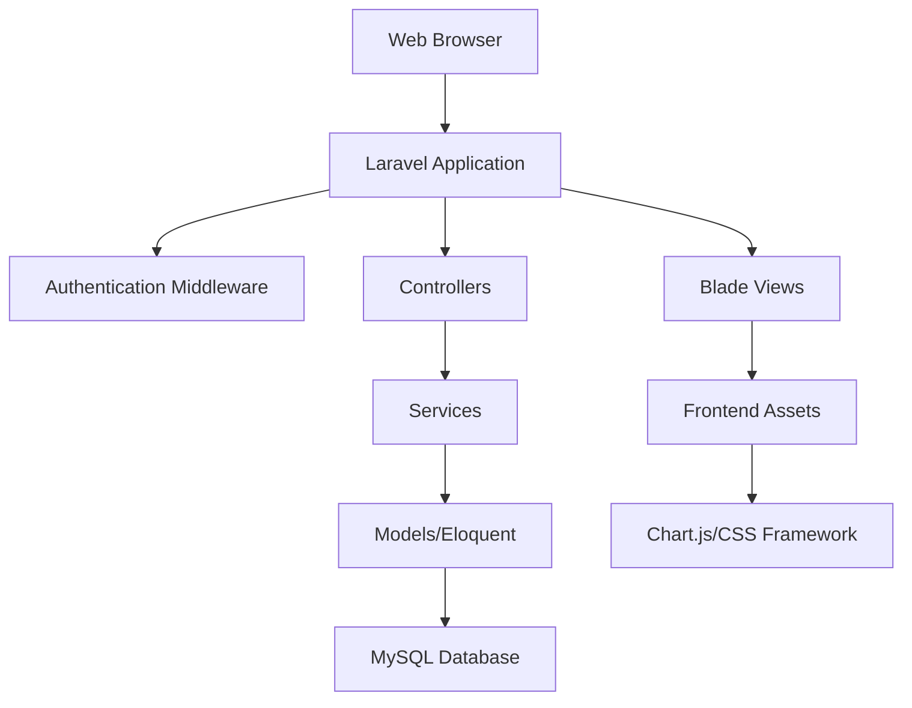

# Design Document - Personal Financial Tracker

## Overview

The Personal Financial Tracker is a Laravel-based web application that provides users with comprehensive personal finance management capabilities. The system follows Laravel's MVC architecture pattern and implements modern web development practices including responsive design, secure authentication, and real-time data visualization.

The application will be built using Laravel 10+ with Blade templating, MySQL database, and modern frontend technologies including Bootstrap/Tailwind CSS for styling and Chart.js for data visualization.

## Architecture

### System Architecture



### Application Structure

- **Presentation Layer**: Blade templates with responsive design
- **Application Layer**: Laravel controllers handling HTTP requests
- **Business Logic Layer**: Service classes for complex operations
- **Data Access Layer**: Eloquent models and repositories
- **Database Layer**: MySQL with proper indexing and relationships

## Components and Interfaces

### Core Models

#### User Model
- Extends Laravel's default User model
- Relationships: hasMany transactions, budgets, goals
- Attributes: name, email, password, email_verified_at, preferences

#### Transaction Model
- Represents income and expense entries
- Relationships: belongsTo user, belongsTo category
- Attributes: user_id, category_id, amount, type (income/expense), description, date, created_at, updated_at

#### Category Model
- Manages transaction categorization
- Relationships: hasMany transactions, belongsTo user
- Attributes: user_id, name, type (income/expense), color, icon, is_default

#### Budget Model
- Tracks spending limits per category
- Relationships: belongsTo user, belongsTo category
- Attributes: user_id, category_id, amount, period (monthly/yearly), start_date, end_date

#### Goal Model
- Manages financial objectives
- Relationships: belongsTo user
- Attributes: user_id, name, target_amount, current_amount, target_date, status, description

### Controllers

#### DashboardController
- Handles main dashboard display
- Aggregates data from multiple services
- Methods: index(), getMonthlyStats(), getBudgetStatus()

#### TransactionController
- Manages CRUD operations for transactions
- Methods: index(), create(), store(), show(), edit(), update(), destroy()
- Implements filtering and pagination

#### BudgetController
- Handles budget management
- Methods: index(), create(), store(), update(), destroy(), checkStatus()

#### GoalController
- Manages financial goals
- Methods: index(), create(), store(), update(), destroy(), updateProgress()

#### ReportController
- Generates financial reports and analytics
- Methods: index(), monthlyReport(), categoryBreakdown(), exportPDF()

### Services

#### TransactionService
- Business logic for transaction operations
- Methods: createTransaction(), updateBudgetUtilization(), categorizeTransaction()

#### BudgetService
- Budget calculation and monitoring logic
- Methods: calculateUtilization(), checkBudgetLimits(), sendNotifications()

#### ReportService
- Report generation and data aggregation
- Methods: generateMonthlyReport(), calculateNetWorth(), getTrendAnalysis()

#### NotificationService
- Handles system notifications
- Methods: sendBudgetAlert(), sendGoalReminder(), sendGoalAchievement()

## Data Models

### Database Schema

#### users table
```sql
- id (primary key)
- name (varchar)
- email (varchar, unique)
- email_verified_at (timestamp)
- password (varchar)
- preferences (json)
- created_at (timestamp)
- updated_at (timestamp)
```

#### categories table
```sql
- id (primary key)
- user_id (foreign key)
- name (varchar)
- type (enum: income, expense)
- color (varchar)
- icon (varchar)
- is_default (boolean)
- created_at (timestamp)
- updated_at (timestamp)
```

#### transactions table
```sql
- id (primary key)
- user_id (foreign key)
- category_id (foreign key)
- amount (decimal 10,2)
- type (enum: income, expense)
- description (text)
- date (date)
- created_at (timestamp)
- updated_at (timestamp)
- deleted_at (timestamp, nullable)
```

#### budgets table
```sql
- id (primary key)
- user_id (foreign key)
- category_id (foreign key)
- amount (decimal 10,2)
- period (enum: monthly, yearly)
- start_date (date)
- end_date (date)
- created_at (timestamp)
- updated_at (timestamp)
```

#### goals table
```sql
- id (primary key)
- user_id (foreign key)
- name (varchar)
- target_amount (decimal 10,2)
- current_amount (decimal 10,2, default 0)
- target_date (date)
- status (enum: active, completed, paused)
- description (text)
- created_at (timestamp)
- updated_at (timestamp)
```

### Relationships

- User hasMany Transactions, Budgets, Goals, Categories
- Transaction belongsTo User, Category
- Budget belongsTo User, Category
- Goal belongsTo User
- Category belongsTo User, hasMany Transactions, Budgets

## Error Handling

### Validation Rules

#### Transaction Validation
- Amount: required, numeric, greater than 0
- Date: required, date, not future date
- Category: required, exists in user's categories
- Description: required, string, max 255 characters

#### Budget Validation
- Amount: required, numeric, greater than 0
- Period: required, in (monthly, yearly)
- Category: required, exists and belongs to user
- Date range: start_date before end_date

#### Goal Validation
- Target amount: required, numeric, greater than current amount
- Target date: required, date, future date
- Name: required, string, max 100 characters

### Exception Handling

- Custom exception classes for business logic errors
- Global exception handler for consistent error responses
- Validation error messages with user-friendly formatting
- Database constraint violation handling
- File upload error handling for report exports

### Security Measures

- CSRF protection on all forms
- SQL injection prevention through Eloquent ORM
- XSS protection via Blade templating
- Authentication middleware on protected routes
- Input sanitization and validation
- Rate limiting on API endpoints

## Testing Strategy

### Unit Testing
- Model validation and relationships
- Service class business logic
- Helper functions and utilities
- Database query optimization

### Feature Testing
- Complete user workflows (registration to dashboard)
- Transaction CRUD operations
- Budget creation and monitoring
- Goal tracking functionality
- Report generation

### Integration Testing
- Authentication flow
- Database transactions
- Email notifications
- File export functionality

### Browser Testing
- Responsive design across devices
- JavaScript functionality
- Form submissions and validations
- Chart rendering and interactions

### Performance Testing
- Database query optimization
- Page load times
- Large dataset handling
- Concurrent user scenarios

## User Interface Design

### Layout Structure
- Responsive sidebar navigation
- Main content area with breadcrumbs
- Header with user menu and notifications
- Footer with application information

### Key Pages
- Dashboard: Overview widgets and charts
- Transactions: List view with filters and quick add
- Budgets: Card-based layout with progress indicators
- Goals: Progress tracking with visual indicators
- Reports: Tabbed interface with chart visualizations
- Settings: Form-based configuration pages

### Design Principles
- Mobile-first responsive design
- Consistent color scheme and typography
- Intuitive navigation and user flows
- Accessibility compliance (WCAG 2.1)
- Fast loading and smooth interactions